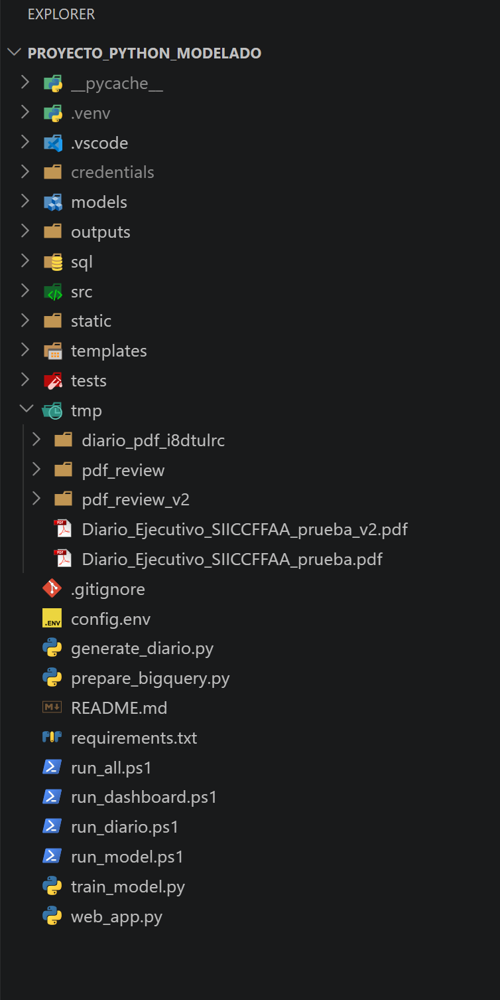

# Proyecto de modelado predictivo SIICCFFAA

## 1. Descripción

Este proyecto entrena y evalúa un modelo de clasificación binaria para estimar si la actividad operacional de una combinación de provincia y tipo de reporte aumentará en el siguiente periodo semanal.

El flujo incluye:

1. Preparación del Dataset Maestro continuo en BigQuery.
2. Validación de la continuidad semanal.
3. Entrenamiento y comparación de modelos.
4. Generación de métricas, gráficos y predicciones.
5. Dashboard web de resultados.
6. Módulo web Diario Ejecutivo.
7. Generación y descarga del Diario Ejecutivo en PDF.

## 2. Modelos evaluados

- **Clase mayoritaria:** referencia mínima que predice siempre la clase más frecuente.
- **Regla de persistencia:** compara el rezago de una semana con la media histórica previa.
- **Regresión logística balanceada:** modelo principal, seleccionado por su rapidez, interpretabilidad y capacidad para producir probabilidades.

La métrica principal es F1 de la clase incremento. También se calculan precisión, recall, PR-AUC, ROC-AUC, matriz de confusión y Precision@20.

## 3. Requisitos

- Windows 10 u 11.
- Python 3.12, 3.13 o 3.14.
- PowerShell.
- Microsoft Edge o Google Chrome para generar el PDF.
- Conexión a Internet.
- Credencial de cuenta de servicio con acceso al proyecto `tfm-sbs` y al dataset `siiccffaa_clean`.

No es necesario instalar Google Cloud SDK, `gcloud` ni `bq`.

## 4. Credencial que recibirá el profesor Jaime

El profesor Jaime recibirá por correo electrónico un archivo de credenciales de Google Cloud en formato JSON. Este archivo contiene información sensible y no se incluye dentro del proyecto entregado.

Después de descargar o descomprimir el proyecto debe realizar lo siguiente:

1. Abrir la carpeta raíz `Proyecto_Python_Modelado`.
2. Crear dentro de ella una carpeta llamada exactamente `credentials`.
3. Copiar dentro de esa carpeta el archivo JSON enviado por correo.
4. Renombrar el archivo como `tfm-evaluacion-api.json`.

La estructura esperada es:



El proyecto detecta automáticamente `credentials/tfm-evaluacion-api.json`. También mantiene compatibilidad con el nombre anterior `tfm-evaluacion-api.key`.

La carpeta `credentials/` está excluida mediante `.gitignore`. No se debe publicar la credencial en GitHub, incluirla en capturas, pegarla en el código ni enviarla por medios no autorizados.

## 5. Primera instalación

Abrir PowerShell en la raíz del proyecto y ejecutar:

```powershell
Set-ExecutionPolicy -Scope Process -ExecutionPolicy Bypass
python -m venv .venv
.\.venv\Scripts\Activate.ps1
python -m pip install -r requirements.txt
```

La política se modifica solamente para la sesión actual de PowerShell.

Si el entorno virtual ya existe y las dependencias están instaladas, no es necesario repetir estos pasos.

## 6. Ejecución completa recomendada

El método más sencillo consiste en ejecutar:

```powershell
.\run_all.ps1
```

Este lanzador realiza automáticamente y en orden:

1. Localización de la credencial JSON.
2. Ejecución de `prepare_bigquery.py`.
3. Creación o actualización de `dataset_maestro_modelado_continuo`.
4. Auditoría de semanas consecutivas.
5. Entrenamiento y evaluación de los modelos.
6. Almacenamiento de la regresión logística.
7. Generación de las señales del Diario Ejecutivo.
8. Reinicio del servidor Flask.
9. Apertura del Diario Ejecutivo en el navegador.

Al terminar estarán disponibles:

- Dashboard del modelo: `http://127.0.0.1:8001/`
- Diario Ejecutivo: `http://127.0.0.1:8001/diario`
- Descarga PDF: `http://127.0.0.1:8001/diario/pdf`
- API de resumen: `http://127.0.0.1:8001/api/summary`

## 7. Ejecución por etapas

### 7.1 Preparar BigQuery

```powershell
.\.venv\Scripts\python.exe prepare_bigquery.py
```

El programa ejecuta `sql/01_dataset_semanal_continuo.sql`. No se debe escribir directamente la ruta del archivo SQL en PowerShell, porque un `.sql` no es un comando de Windows.

La consulta completa las semanas ausentes con cero, recalcula rezagos y medias y comprueba que las observaciones consecutivas estén separadas por siete días.

### 7.2 Entrenar el modelo

```powershell
.\run_model.ps1
```

Este comando instala únicamente las dependencias que falten, consulta BigQuery, divide los datos cronológicamente, entrena los modelos y guarda las métricas.

### 7.3 Abrir solo el dashboard

```powershell
.\run_dashboard.ps1
```

Dirección: `http://127.0.0.1:8001/`

El dashboard muestra comparación de modelos, precisión, recall, F1, PR-AUC, ROC-AUC, Precision@20, matriz de confusión, curvas, coeficientes y predicciones del bloque de prueba.

### 7.4 Generar el Diario Ejecutivo

```powershell
.\run_diario.ps1
```

Dirección: `http://127.0.0.1:8001/diario`

El módulo utiliza la última semana disponible y presenta operaciones, media de cuatro semanas, tendencia, probabilidad de incremento y prioridad. El botón **Descargar PDF** genera el documento institucional con los logos del MIDE y C5i.

## 8. Interpretación temporal

La fecha del Diario Ejecutivo no avanza por ejecutar varias veces el programa. Se toma de la última semana disponible en BigQuery.

Por ejemplo:

```text
Último reporte limpio:  2026-05-30
Semana observada:       2026-05-25
Semana estimada:        2026-06-01
```

Los reportes del 25 al 30 de mayo pertenecen a la semana iniciada el lunes 25. El modelo estima la semana siguiente. Para que la fecha avance deben existir nuevos reportes en BigQuery y actualizarse las tablas limpias.

## 9. Principales salidas

### Carpeta `models`

- `logistic_regression.joblib`: Pipeline entrenado.
- `metadata.json`: variables, fechas, tamaños de bloques y umbral.

### Carpeta `outputs`

- `model_comparison.csv`: métricas de los modelos.
- `predictions_test.csv`: probabilidades y resultados del bloque de prueba.
- `coefficients.csv`: coeficientes y odds ratios.
- `weekly_continuity_gaps.csv`: auditoría temporal.
- `confusion_matrix.png`: matriz de confusión.
- `precision_recall_curve.png`: curva precisión-recall.
- `roc_curve.png`: curva ROC.
- `diario_ejecutivo.json`: contenido del Diario Ejecutivo.
- `Diario_Ejecutivo_SIICCFFAA.pdf`: PDF generado.

## 10. Estructura del código

- `prepare_bigquery.py`: ejecuta la preparación SQL.
- `train_model.py`: coordina carga, validación, entrenamiento y evaluación.
- `generate_diario.py`: aplica el modelo al último periodo disponible.
- `web_app.py`: aplicación Flask del dashboard y Diario Ejecutivo.
- `src/config.py`: configuración, variables y detección de credenciales.
- `src/data.py`: lectura desde BigQuery o CSV.
- `src/validation.py`: validaciones de esquema, grano y continuidad.
- `src/modeling.py`: baselines, regresión logística y división temporal.
- `src/evaluation.py`: métricas, umbral, coeficientes y gráficos.
- `sql/01_dataset_semanal_continuo.sql`: cuadrícula temporal y Dataset Maestro.

## 11. Errores frecuentes

### No se encuentra la credencial

Comprobar que exista:

```text
credentials/tfm-evaluacion-api.json
```

El archivo debe ser el JSON completo enviado por correo, no un documento de texto vacío ni un acceso directo.

### PowerShell bloquea los scripts

```powershell
Set-ExecutionPolicy -Scope Process -ExecutionPolicy Bypass
```

### El puerto 8001 está ocupado

Cerrar la instancia anterior o detener el proceso desde la terminal con `Ctrl + C`. `run_all.ps1` intenta reiniciar automáticamente la aplicación perteneciente a este proyecto.

### El dashboard muestra una versión anterior

Actualizar el navegador con `Ctrl + F5`.

### La fecha del Diario Ejecutivo no cambia

La tabla limpia no contiene semanas nuevas. Se debe actualizar el origen y volver a ejecutar `run_all.ps1`.

### Error 403 de BigQuery

La cuenta se autenticó, pero no tiene permiso para consultar o crear alguna tabla. Deben revisarse los permisos del proyecto, dataset y ubicación `europe-southwest1`.

## 12. Seguridad y uso responsable

Las probabilidades son señales analíticas para priorizar revisión humana. No representan certeza, causalidad ni una orden automática de actuación.

La credencial JSON es secreta. Si se publica o comparte accidentalmente, debe revocarse y sustituirse por una nueva desde Google Cloud IAM.
